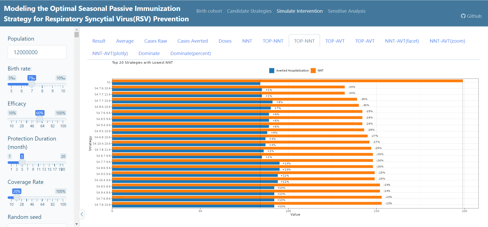
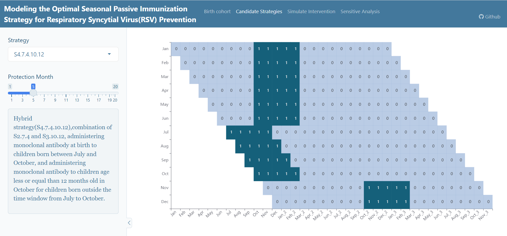
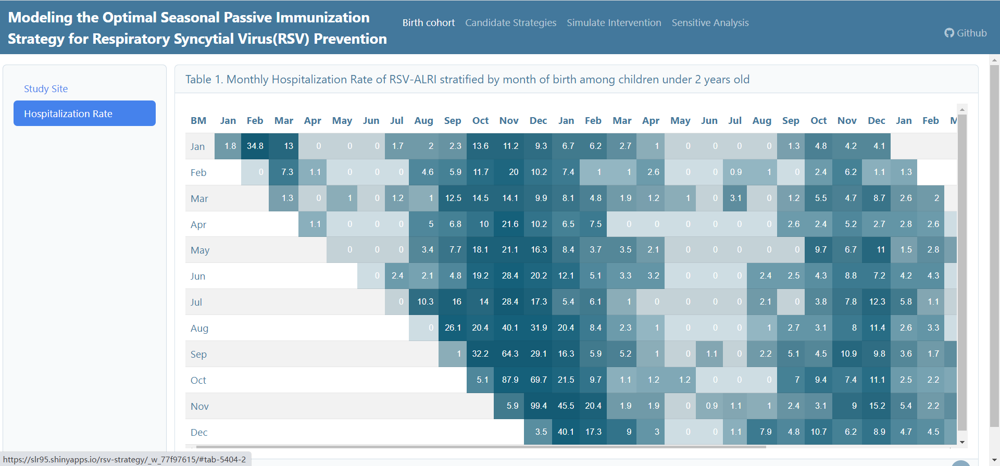
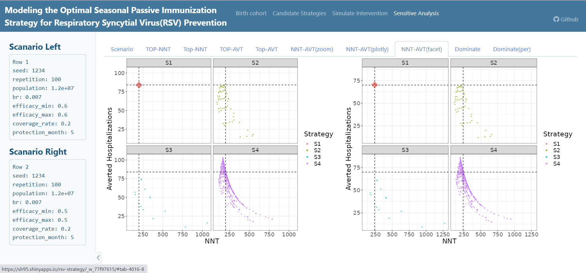
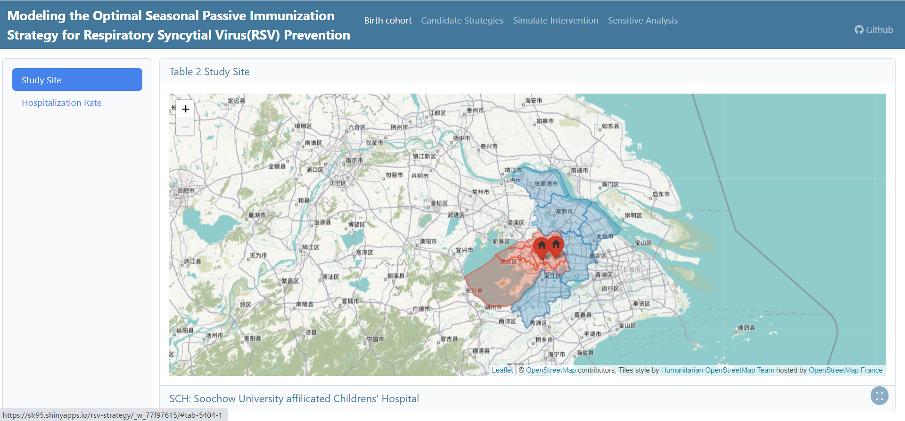

# A Shiny App for Modeling the Optimal RSV Passsive Immunization Strategy



Welcome to the Shiny application for modeling the optimal RSV (Respiratory Syncytial Virus) passive immunization strategy. This application is designed to simulate and evaluate the effectiveness and cost-effectiveness of different passive RSV  immunization strategies for preventing RSV-ALRI hospitalization.

## Introduction

Respiratory Syncytial Virus (RSV) is a common respiratory virus that can cause serious illness, especially in young children and older adults. Passive immunization, which involves the administration of monoclonal antibodies, is a potential strategy to mitigate the impact of RSV infections. This Shiny application provides a user-friendly interface to model and analyze different scenarios for RSV passive immunization strategies.

## Features

-   **User-Friendly Interface:** The application offers an intuitive interface to input various parameters and settings for the RSV passive immunization model.

-   **Dynamic Modeling:** Users can input different parameters related to population demographics, mAb efficacy and more to observe the potential outcomes of different immunization strategies.

-   **Visualization:** The application generates visualizations, including graphs and charts, to help users understand the implications of their chosen parameters and strategies.

   

## Getting Started

1.  Clone this repository to your local machine or server.

    ```{bash}
    git clone https://github.com/shalom-lab/rsv-shiny.git
    ```

2.  Install the required R packages. Open R and run the following commands:

    ```{r}
    install.packages("shiny")
    # Install other required packages
    ```

3.  Open RStudio and set the working directory to where you cloned the repository and Run the Shiny application.

    ```{r}
    # Run the Shiny application
    library(shiny)
    runApp("app.R")
    ```

## Session Info

```         
─ Session info ──────────────────────────────────────────────────────────────────────
 setting  value
 version  R version 4.2.0 (2022-04-22 ucrt)
 os       Windows 10 x64 (build 19045)
 system   x86_64, mingw32
 ui       RStudio
 language (EN)
 collate  Chinese (Simplified)_China.utf8
 ctype    Chinese (Simplified)_China.utf8
 tz       Asia/Taipei
 date     2023-08-28
 rstudio  2023.06.1+524 Mountain Hydrangea (desktop)
 pandoc   NA

─ Packages ──────────────────────────────────────────────────────────────────────────
 package           * version date (UTC) lib source
 askpass             1.1     2019-01-13 [1] CRAN (R 4.2.0)
 bslib             * 0.5.0   2023-06-09 [1] CRAN (R 4.2.3)
 cachem              1.0.7   2023-02-24 [1] CRAN (R 4.2.3)
 cellranger          1.1.0   2016-07-27 [1] CRAN (R 4.2.0)
 cli                 3.6.1   2023-03-23 [1] CRAN (R 4.2.3)
 codetools           0.2-18  2020-11-04 [1] CRAN (R 4.2.0)
 colorspace          2.0-3   2022-02-21 [1] CRAN (R 4.2.0)
 crayon              1.5.2   2022-09-29 [1] CRAN (R 4.2.2)
 crosstalk           1.2.0   2021-11-04 [1] CRAN (R 4.2.0)
 curl                4.3.2   2021-06-23 [1] CRAN (R 4.2.0)
 data.table          1.14.8  2023-02-17 [1] CRAN (R 4.2.3)
 digest              0.6.31  2022-12-11 [1] CRAN (R 4.2.3)
 dplyr             * 1.1.1   2023-03-22 [1] CRAN (R 4.2.3)
 DT                * 0.28    2023-05-18 [1] CRAN (R 4.2.3)
 echarts4r         * 0.4.4   2023-03-09 [1] Github (JohnCoene/echarts4r@08b98ee)
 ellipsis            0.3.2   2021-04-29 [1] CRAN (R 4.2.0)
 fansi               1.0.4   2023-01-22 [1] CRAN (R 4.2.3)
 farver              2.1.1   2022-07-06 [1] CRAN (R 4.2.2)
 fastmap             1.1.1   2023-02-24 [1] CRAN (R 4.2.3)
 fontawesome         0.5.1   2023-04-18 [1] CRAN (R 4.2.3)
 forcats           * 1.0.0   2023-01-29 [1] CRAN (R 4.2.3)
 foreign             0.8-82  2022-01-16 [1] CRAN (R 4.2.0)
 fs                  1.6.2   2023-04-25 [1] CRAN (R 4.2.3)
 furrr             * 0.3.1   2022-08-15 [1] CRAN (R 4.2.1)
 future            * 1.29.0  2022-11-06 [1] CRAN (R 4.2.2)
 generics            0.1.3   2022-07-05 [1] CRAN (R 4.2.2)
 ggforce           * 0.4.1   2022-10-04 [1] CRAN (R 4.2.3)
 ggplot2           * 3.4.2   2023-04-03 [1] CRAN (R 4.2.3)
 ggrepel           * 0.9.2   2022-11-06 [1] CRAN (R 4.2.2)
 ggsci             * 2.9     2018-05-14 [1] CRAN (R 4.2.0)
 ggthemes          * 4.2.4   2021-01-20 [1] CRAN (R 4.2.2)
 globals             0.16.2  2022-11-21 [1] CRAN (R 4.2.2)
 glue              * 1.6.2   2022-02-24 [1] CRAN (R 4.2.0)
 gtable              0.3.1   2022-09-01 [1] CRAN (R 4.2.2)
 haven               2.5.2   2023-02-28 [1] CRAN (R 4.2.3)
 hms                 1.1.3   2023-03-21 [1] CRAN (R 4.2.3)
 htmltools           0.5.5   2023-03-23 [1] CRAN (R 4.2.3)
 htmlwidgets         1.6.2   2023-03-17 [1] CRAN (R 4.2.3)
 httpuv              1.6.9   2023-02-14 [1] CRAN (R 4.2.3)
 httr                1.4.5   2023-02-24 [1] CRAN (R 4.2.3)
 janitor           * 2.1.0   2021-01-05 [1] CRAN (R 4.2.0)
 jquerylib           0.1.4   2021-04-26 [1] CRAN (R 4.2.0)
 jsonlite            1.8.4   2022-12-06 [1] CRAN (R 4.2.3)
 labeling            0.4.2   2020-10-20 [1] CRAN (R 4.2.0)
 later               1.3.0   2021-08-18 [1] CRAN (R 4.2.0)
 lattice             0.20-45 2021-09-22 [1] CRAN (R 4.2.0)
 lazyeval            0.2.2   2019-03-15 [1] CRAN (R 4.2.0)
 leaflet           * 2.1.1   2022-03-23 [1] CRAN (R 4.2.0)
 leaflet.providers   1.9.0   2019-11-09 [1] CRAN (R 4.2.0)
 lifecycle           1.0.3   2022-10-07 [1] CRAN (R 4.2.1)
 listenv             0.8.0   2019-12-05 [1] CRAN (R 4.2.0)
 lubridate         * 1.9.2   2023-02-10 [1] CRAN (R 4.2.3)
 magrittr            2.0.3   2022-03-30 [1] CRAN (R 4.2.0)
 MASS                7.3-56  2022-03-23 [1] CRAN (R 4.2.0)
 memoise             2.0.1   2021-11-26 [1] CRAN (R 4.2.0)
 mime                0.12    2021-09-28 [1] CRAN (R 4.2.0)
 munsell             0.5.0   2018-06-12 [1] CRAN (R 4.2.0)
 openssl             2.0.6   2023-03-09 [1] CRAN (R 4.2.3)
 openxlsx            4.2.5.2 2023-02-06 [1] CRAN (R 4.2.3)
 pacman              0.5.1   2019-03-11 [1] CRAN (R 4.2.2)
 parallelly          1.32.1  2022-07-21 [1] CRAN (R 4.2.1)
 patchwork         * 1.1.2   2022-08-19 [1] CRAN (R 4.2.2)
 pillar              1.9.0   2023-03-22 [1] CRAN (R 4.2.3)
 pkgconfig           2.0.3   2019-09-22 [1] CRAN (R 4.2.0)
 plotly            * 4.10.0  2021-10-09 [1] CRAN (R 4.2.1)
 polyclip            1.10-4  2022-10-20 [1] CRAN (R 4.2.1)
 promises            1.2.0.1 2021-02-11 [1] CRAN (R 4.2.0)
 purrr             * 1.0.1   2023-01-10 [1] CRAN (R 4.2.2)
 R6                  2.5.1   2021-08-19 [1] CRAN (R 4.2.0)
 ragg                1.2.5   2023-01-12 [1] CRAN (R 4.2.3)
 Rcpp                1.0.10  2023-01-22 [1] CRAN (R 4.2.3)
 readr             * 2.1.4   2023-02-10 [1] CRAN (R 4.2.3)
 readxl              1.4.2   2023-02-09 [1] CRAN (R 4.2.3)
 rgdal             * 1.6-4   2023-01-12 [1] CRAN (R 4.2.2)
 rio               * 0.5.29  2021-11-22 [1] CRAN (R 4.2.0)
 rlang               1.1.1   2023-04-28 [1] CRAN (R 4.2.0)
 rsconnect           1.0.2   2023-08-17 [1] CRAN (R 4.2.0)
 rstudioapi          0.14    2022-08-22 [1] CRAN (R 4.2.2)
 sass                0.4.5   2023-01-24 [1] CRAN (R 4.2.3)
 scales              1.2.1   2022-08-20 [1] CRAN (R 4.2.2)
 sessioninfo         1.2.2   2021-12-06 [1] CRAN (R 4.2.0)
 shiny             * 1.7.4   2022-12-15 [1] CRAN (R 4.2.3)
 showtext          * 0.9-5   2022-02-09 [1] CRAN (R 4.2.1)
 showtextdb        * 3.0     2020-06-04 [1] CRAN (R 4.2.1)
 snakecase           0.11.0  2019-05-25 [1] CRAN (R 4.2.0)
 sp                * 1.5-1   2022-11-07 [1] CRAN (R 4.2.2)
 stringi             1.7.12  2023-01-11 [1] CRAN (R 4.2.2)
 stringr           * 1.5.0   2022-12-02 [1] CRAN (R 4.2.0)
 sysfonts          * 0.8.8   2022-03-13 [1] CRAN (R 4.2.1)
 systemfonts         1.0.4   2022-02-11 [1] CRAN (R 4.2.1)
 textshaping         0.3.6   2021-10-13 [1] CRAN (R 4.2.3)
 tibble            * 3.2.1   2023-03-20 [1] CRAN (R 4.2.3)
 tictoc            * 1.2     2023-04-23 [1] CRAN (R 4.2.3)
 tidyr             * 1.3.0   2023-01-24 [1] CRAN (R 4.2.2)
 tidyselect          1.2.0   2022-10-10 [1] CRAN (R 4.2.1)
 tidyverse         * 2.0.0   2023-02-22 [1] CRAN (R 4.2.3)
 timechange          0.1.1   2022-11-04 [1] CRAN (R 4.2.2)
 tweenr              2.0.2   2022-09-06 [1] CRAN (R 4.2.1)
 tzdb                0.3.0   2022-03-28 [1] CRAN (R 4.2.0)
 utf8                1.2.3   2023-01-31 [1] CRAN (R 4.2.3)
 vctrs               0.6.2   2023-04-19 [1] CRAN (R 4.2.3)
 viridisLite         0.4.1   2022-08-22 [1] CRAN (R 4.2.2)
 withr               2.5.0   2022-03-03 [1] CRAN (R 4.2.0)
 xtable              1.8-4   2019-04-21 [1] CRAN (R 4.2.0)
 yaml                2.3.7   2023-01-23 [1] CRAN (R 4.2.3)
 zip                 2.3.0   2023-04-17 [1] CRAN (R 4.2.3)

 [1] D:/Program Files/R/R-4.2.0/library
```

## Contact Information

For questions or inquiries, please contact [slren95\@163.com](mailto:slren95@163.com)
